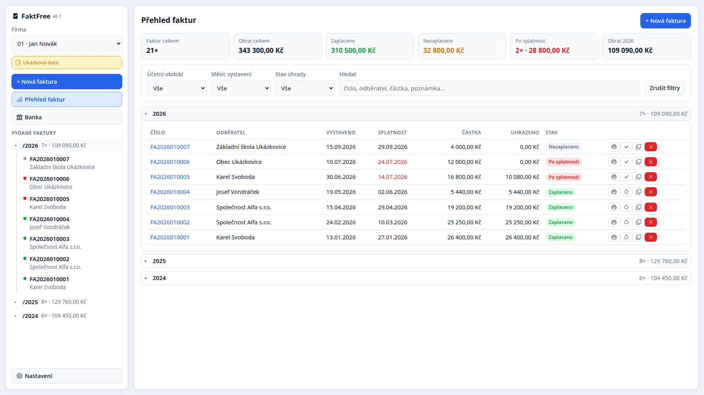
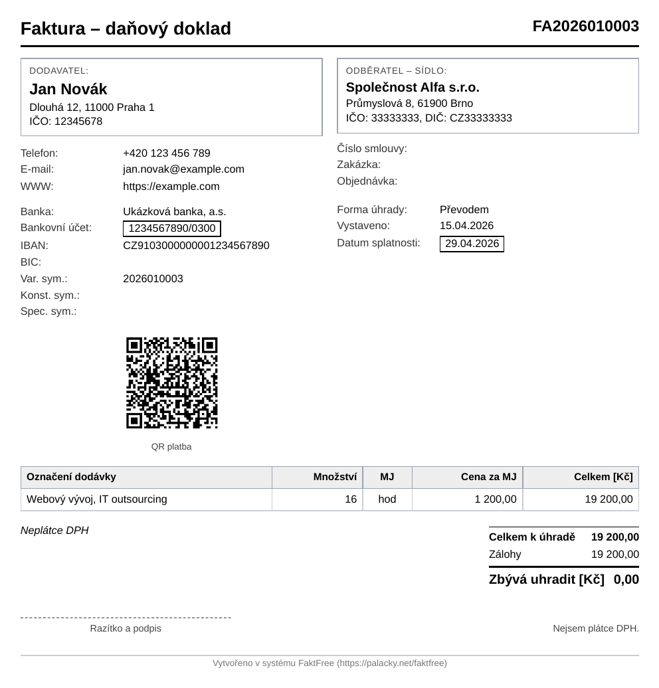

<p align="center">
  
</p>

<h1 align="center">FaktFree</h1>

<p align="center">
  <strong>Fakturace pro OSVČ a drobné podnikatele, která je <em>fakt free</em>.</strong><br>
  Bez serveru, bez databáze, bez registrace a bez měsíčních poplatků. Data zůstávají u vás v prohlížeči.
</p>

<p align="center">
  <a href="https://palacky.net/faktfree/"><strong>▶ Vyzkoušet online</strong></a>
  &nbsp;·&nbsp; <a href="#rychlý-start">Nainstalovat</a>
  &nbsp;·&nbsp; <a href="#co-umí">Co umí</a>
  &nbsp;·&nbsp; <a href="#soukromí-a-data">Soukromí</a>
</p>

---

## Co je FaktFree

Jednoduchý systém pro evidenci faktur. Není to účetní program ani sklad – je to nástroj, který
zařídí přesně to, co živnostník doopravdy potřebuje: **vystavit fakturu, poslat ji, ohlídat, kdo
zaplatil, a mít z toho přehled a podklady pro daňového poradce.**

Běží celý v prohlížeči. Není co instalovat na hosting, není se kam registrovat, není co platit.
Po prvním otevření funguje i bez internetu a můžete si ji „nainstalovat“ jako běžnou aplikaci
do počítače nebo do mobilu.

A co je na ní nejlepší? **Je Fakt Free.** 🙂

## Co umí

| | |
| --- | --- |
| **Faktury** | Vystavení, editace, duplikace, smazání. Automatické číslování (prefix + rok + kód firmy + pořadí) a tisk do A4, případně PDF. |
| **QR platba** | Platební QR kód (formát SPD) přímo na faktuře – vygeneruje se v prohlížeči, bez internetu i bez placené služby. |
| **Odběratelé** | Číselník s načtením údajů z **ARES** podle IČO jedním kliknutím. |
| **Položky a DPH** | Číselník položek s našeptávačem, měrné jednotky, množství, sleva, DPH 0/12/21 % a zaokrouhlení. |
| **Banka** | Import výpisu (ABO/GPC), párování plateb s fakturami, částečné úhrady, vratky, přehledy a fulltext. |
| **Přehledy** | Souhrny po letech, stav úhrady (zaplaceno / částečně / po splatnosti), rychlé filtry. |
| **Import z jiných systémů** | ABRA Flexi (XML) a ISDOC / ISDOCX. Odběratelé, položky i měrné jednotky se doplní samy. |
| **Záloha a přenos** | Export a import všech dat do jediného souboru – snadný přenos na jiný počítač i záloha. Když je záloha stará, aplikace to v panelu decentně připomene. |
| **Offline a instalace** | Po prvním načtení funguje bez internetu a chová se jako nainstalovaná aplikace. |
| **Vzhled** | Světlý a tmavý režim, deset témat a možnost přidat si vlastní téma. |
| **Neměnné doklady** | Faktura si pamatuje údaje z okamžiku vystavení, takže se staré doklady zpětně „nepřepisují“. |

<p align="center">
  
  
  <br>
  <em>Přehled faktur a vytištěná faktura na A4 – s QR platbou a patičkou.</em>
</p>

## Pro koho to je

- **OSVČ a živnostníci**, kteří chtějí mít fakturaci pod kontrolou a nechtějí platit za agendu.
- **Malé firmy**, které nepotřebují sklad, mzdy ani skladové hospodářství.
- Každý, kdo chce mít **doklady u sebe** – ne v cizím cloudu.

**Co to (zatím) není:** náhrada účetního programu. Přiznání k DPH ani daňové přiznání nepodá,
sklad a mzdy nevede.

## Vyzkoušet bez instalace

Nejrychlejší cesta: otevřete <https://palacky.net/faktfree/>, klikněte na **Ukázková data**
a všechno si projděte. Ukázková data si pak jednou tlačítkem smažete a začnete načisto.

## Rychlý start

1. **Stáhněte si aplikaci** – tlačítkem *Code → Download ZIP*, nebo si repozitář naklonujte:

   ```bash
   git clone https://github.com/p3t3r50n-cz/faktfree.git
   ```
2. **Nahrajte obsah složky na svůj web** (klidně do podadresáře, třeba `/faktfree/`).
   Nic víc – žádné PHP, žádná databáze, žádný build.
3. **Otevřete adresu v prohlížeči** a v *Nastavení* vyplňte údaje své firmy (IČO, adresu,
   bankovní účet – z něj se počítá QR platba).

Adresa musí být **HTTPS** (nebo `localhost`). Bez toho prohlížeč nepovolí offline režim a
instalaci aplikace.

Na zkoušení stačí i jediný příkaz, když máte v počítači Python (spusťte ho ve složce s aplikací):

```bash
python3 -m http.server 8099      # → http://localhost:8099
```

### Instalace jako aplikace

V Chromiu, Edge nebo Brave se v adresním pruhu objeví nabídka **Nainstalovat**, případně ji
najdete v *Nastavení → Aplikace → Nainstalovat aplikaci*. Aplikace pak má vlastní okno
bez adresního pruhu a vlastní ikonu v nabídce. Ve Firefoxu všechno funguje taky, jen si ji
jako aplikaci nainstalovat nelze.

## Soukromí a data

- Všechna data (faktury, odběratelé, položky, platby) jsou uložená **jen ve vašem prohlížeči**.
  Aplikace nikam nic neposílá a neexistuje žádný server, který by je mohl vidět.
- Jediná výjimka je vyhledávání v **ARES**, když na něj sami kliknete – tehdy se do státního
  registru odešle hledané IČO.
- Data „patří“ prohlížeči a dané adrese. Proto platí dvě pravidla:
  - **Zálohujte** (*Nastavení → Záloha dat* vyexportuje jeden soubor se vším).
  - **Přenos na jiný počítač** je export + import zálohy. Přesun na jinou doménu = nová
    prázdná databáze, na stejné doméně v podadresáři data zůstávají.

## Co k tomu potřebujete

- Moderní prohlížeč (Chrome, Chromium, Edge, Brave, Firefox).
- Web s HTTPS (nebo `localhost`) – kvůli offline režimu a instalaci.
- To je vše. Žádný server, databáze, PHP ani Node.js.

## Struktura repozitáře

Aplikace je **v kořeni repozitáře** – naklonovaná (nebo rozbalená) složka je rovnou
to, co se nasazuje.

| Složka / soubor | Co to je |
| --- | --- |
| `index.html` | skořápka aplikace |
| `manifest.webmanifest`, `sw.js` | metadata PWA a service worker (offline režim) |
| `css/`, `js/`, `icons/` | vzhled, logika (ES moduly) a ikony |
| `brand/` | Logo a pravidla jeho použití. |
| `docs/` | Screenshoty použité v tomto README. |
| `samples/` | Návod, jak si připravit vzorky na testování importu. **Skutečné doklady tu nejsou** – obsahovaly by reálné údaje. |
| `CHANGELOG.md` | Historie změn po verzích. |
| `DEVELOPMENT.md` | Technické detaily, konvence a poznámky k vývoji. |

> Původní jednosouborová PHP verze zůstala v soukromém repu `faktury` – sem nepatří,
už se nevyvíjí.

## Zajímavosti z implementace

Pro zvědavé: aplikace nemá žádný build ani závislosti. QR platba má vlastní generátor,
ISDOCX (ZIP s fakturou) se rozbaluje přímo v prohlížeči a offline režim drží service worker.
Díky tomu je celá aplikace několik stovek kilobajtů a funguje i na starém notebooku.

## Přispějte

Našli jste chybu nebo vám něco chybí? Založte **issue** v [repozitáři](https://github.com/p3t3r50n-cz/faktfree/issues),
případně pošlete pull request – česky i anglicky. Uvítám i návrhy na zjednodušení:
cílem je, aby fakturace byla nuda.

## Licence

[MIT](LICENSE) – používejte, upravujte a šiřte dál, klidně i komerčně.
Autorem je **Petr Palacký** ([palacky.net](https://palacky.net)).

Text licence je i v aplikaci: *Nastavení → Aplikace → Zobrazit licenci*.

Použité cizí komponenty (ikony z Bootstrap Icons) a zdroje dat (ARES, ISDOC, ABO) jsou
vypsané v [THIRD-PARTY.md](THIRD-PARTY.md).

## Verze

Aktuální verze je **0.3**. Každé další vydání zvyšuje desetinu: 0.4, 0.5, … až 1.0.

## Poděkování

- [Bootstrap Icons](https://icons.getbootstrap.com) (MIT) za ikony v aplikaci.
- [ARES](https://ares.gov.cz) za veřejný registr ekonomických subjektů.
- Standardu **ISDOC** a formátu **ABO/GPC** za to, že se s nimi dá rozumně domluvit.
